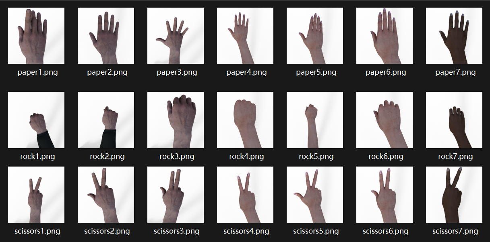
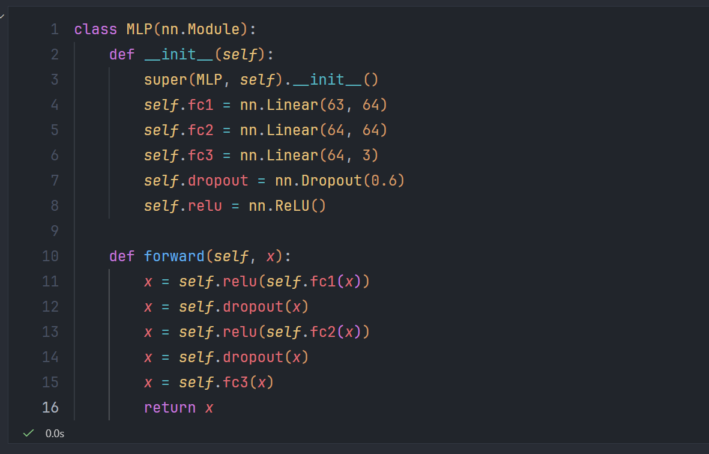
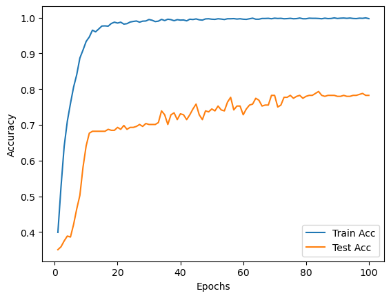

# **《基于Mediapipe的石头剪刀布手势识别系统》项目介绍**

 > 项目代码详见: https://github.com/Yoyo-0125/Mediapipe-RPS

---

## **一、项目背景**

随着人工智能和计算机视觉技术的发展，机器能够通过摄像头识别人的姿态与动作已成为现实。在日常生活中，“石头剪刀布”是一种简单且互动性强的游戏，非常适合作为手势识别技术的入门实践。本项目基于 MediaPipe Hands 与自行构建的 MLP（多层感知机）神经网络模型，实现实时识别石头、剪刀、布三种手势动作。

该项目不仅展示了图像处理与机器学习的结合，也让同学们更直观地理解 AI 是如何“看懂”人的动作的。

---

## **二、项目原理**

### **1. 手势关键点提取（MediaPipe Hands）**

系统首先使用 Google 的 MediaPipe Hands 模型从摄像头画面中检测手部，共返回 **21 个关键点**。每个关键点包含 **(x, y, z)** 三维坐标。

这些关键点构成一串固定长度的“数字化手势”，为后续的深度学习模型提供稳定输入。

### **2. 数据预处理与特征构建**

为了便于训练，所有关键点会：

* 进行归一化
* 转换为 63 维向量（21 点 × 3 维）
* 组成手势数据集
* **进行数据变换!!!**（包括与手腕坐标标准化等）

这些数据随后被划分为训练集与测试集。

### **3. 手势分类模型（MLP）**

本项目使用一个三层 MLP 进行识别，结构包括：

* Full Connect Layer（提取特征）
* Dropout（降低过拟合）
* ReLU 激活函数

最终模型可在测试集上达到 **80%+ 准确率**。

---

## **三、项目功能展示**

系统通过摄像头实时捕捉手势，并在屏幕上显示识别结果。
可识别：

* ✊ 石头（Rock）
* ✋ 布（Paper）
* ✌️ 剪刀（Scissors）

识别过程仅需几十毫秒，具有很好的实时性。

在识别玩家手势后，系统会：
* AI出一个相反与玩家的手势
* 在屏幕实时显示玩家手势

---

## **四、项目展望**
* 提升模型性能与识别**鲁棒性**，继续优化手势识别模型
* 扩充训练数据规模与数据增强
* 加入光照、背景、角度等数据增强
  以提升系统在各种环境和人群中的泛化能力与准确率。
* 扩展手势类型并丰富互动方式
* 推向更多平台与实际应用场景

